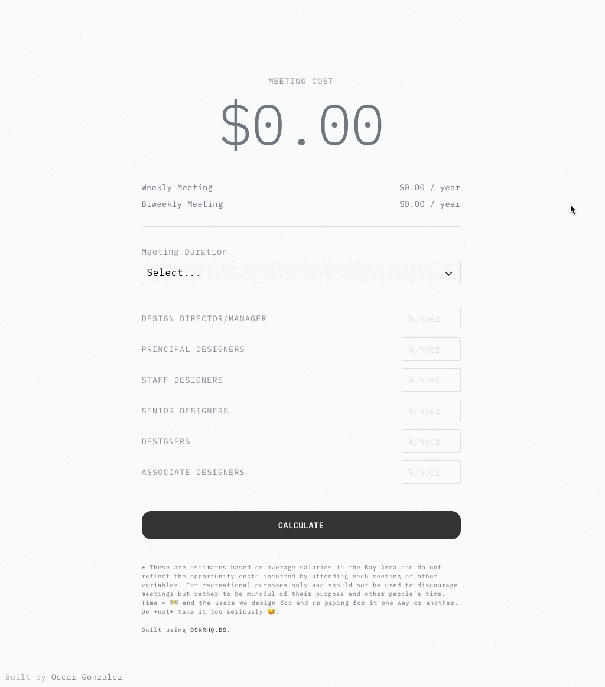

## 🚀 Quick start

1.  **Install Dependencies**
    ```sh
    yarn install
    ```
1.  **Run**
    ```sh
    yarn start
    ```
1.  **Deploy**
    ```sh
    npm run build
    cd public/
    surge
    ```

 